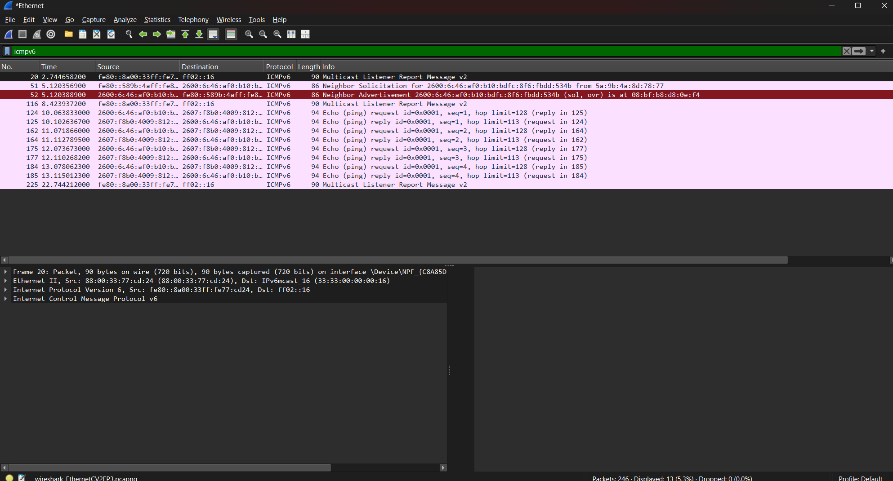
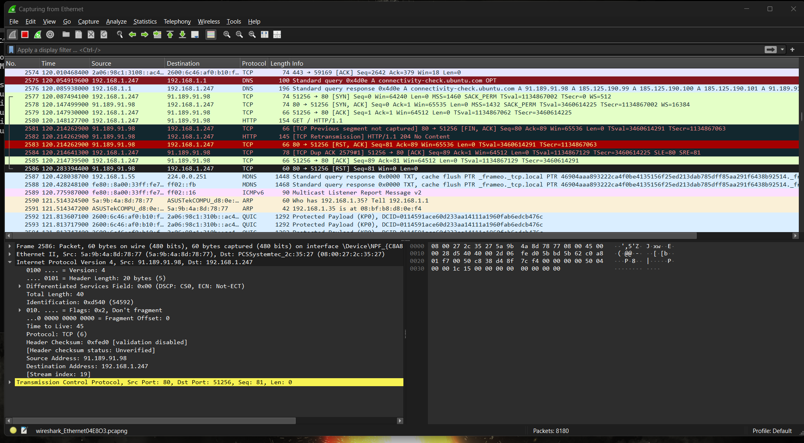
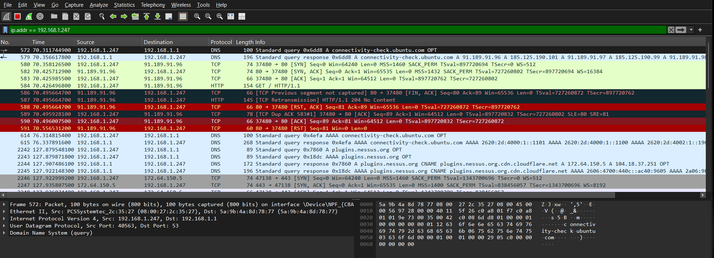
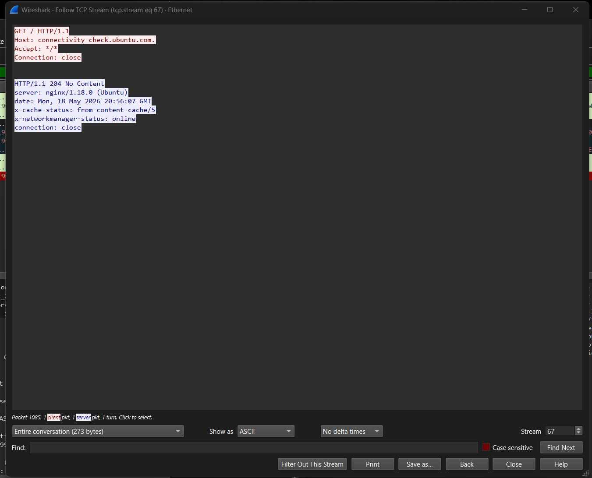
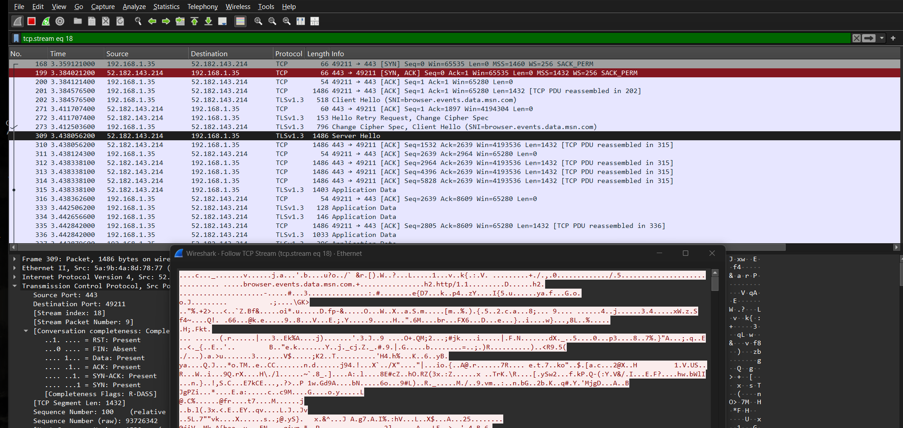
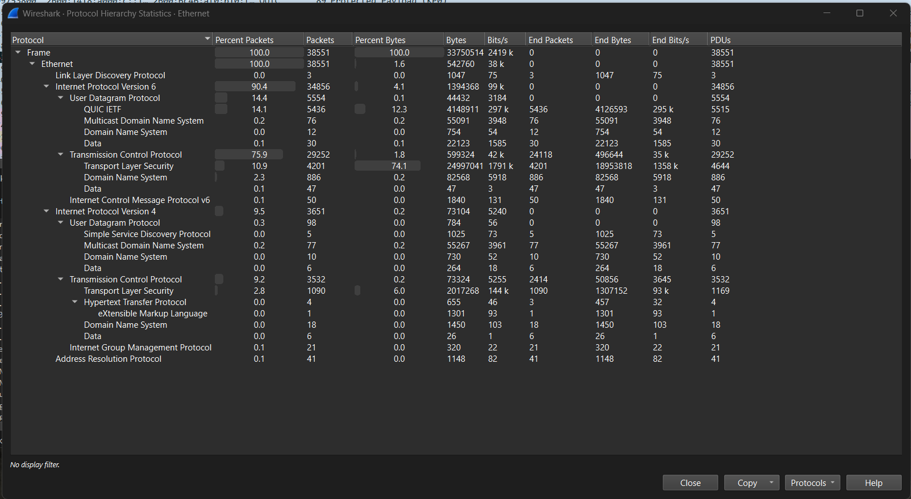
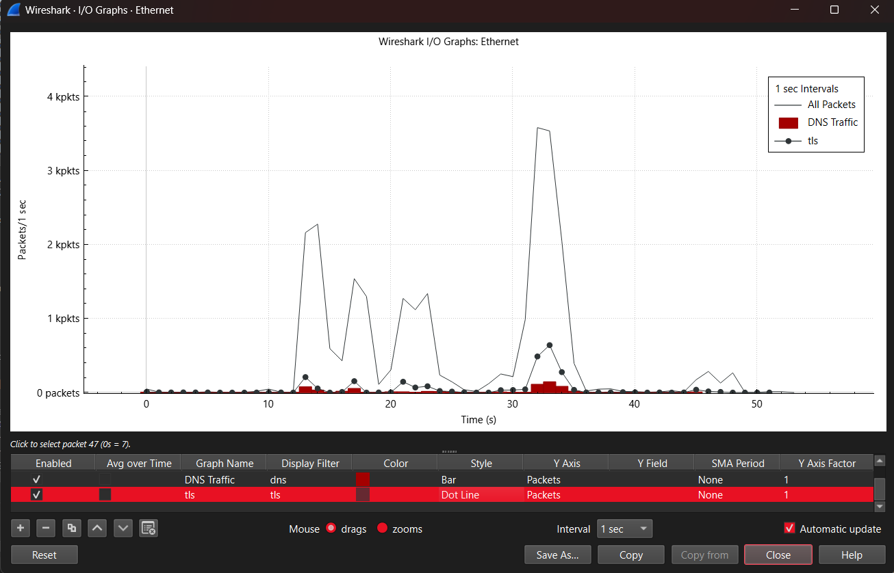

# -Wireshark-Packet-Analysis-and-Threat-Hunting-Lab
Hands-on Wireshark lab focused on packet analysis, TCP/IP communication, protocol analysis, HTTP vs HTTPS inspection, traffic visualization, and network traffic investigation techniques.

## Project Overview

This project focused on analyzing real network traffic using Wireshark in a controlled lab environment. The objective was to build hands-on experience with packet analysis, protocol inspection, network troubleshooting, and basic threat hunting concepts commonly used in Security Operations Center (SOC) environments.

The lab included capturing and analyzing multiple network protocols, investigating packet behavior, comparing encrypted and unencrypted traffic, and visualizing network activity patterns using Wireshark statistics and filtering techniques.

---

## Objectives

- Capture and analyze live network traffic
- Understand TCP/IP communication fundamentals
- Analyze ICMP and DNS traffic
- Observe TCP handshakes and packet flows
- Compare HTTP and HTTPS traffic behavior
- Use Follow TCP Stream to inspect conversations
- Visualize protocol activity using IO Graphs
- Practice Wireshark filtering and traffic investigation techniques
- Develop foundational packet analysis skills for SOC analyst workflows

---

## Lab Environment

| Component | Details |
|---|---|
| Host System | Windows 11 |
| Virtualization | VirtualBox |
| Virtual Machine | Ubuntu Linux |
| Network Mode | Bridged Adapter |
| Analysis Tool | Wireshark |
| Additional Tools | Command Prompt, OpenSSH |

---

## Tools Used

- Wireshark
- VirtualBox
- Ubuntu Linux
- Windows Command Prompt
- OpenSSH Client

---

# ICMP Packet Analysis

ICMPv6 traffic was generated using ping requests to observe request and reply behavior at the packet level. Packet analysis included reviewing sequence numbers, hop limits, and ICMP message types.

### Key Concepts Observed

- Echo request and echo reply communication
- ICMPv6 packet structure
- Sequence number tracking
- Basic network reachability testing

---

# TCP Handshake Analysis

TCP traffic was analyzed to observe the standard three-way handshake process used to establish reliable network communication.

### Key Concepts Observed

- SYN packet initiation
- SYN/ACK server response
- ACK session establishment
- TCP connection reliability

---

# HTTP Traffic Analysis

Unencrypted HTTP traffic was analyzed to observe plaintext web communication between systems.

### Key Concepts Observed

- HTTP GET requests
- Destination port 80 communication
- Packet flow visibility
- Plaintext protocol exposure

---

# HTTP Stream Reconstruction

Wireshark's Follow TCP Stream feature was used to reconstruct HTTP conversations and inspect transmitted data.

### Key Concepts Observed

- Reconstructed client/server communication
- HTTP headers and responses
- Visibility into unencrypted traffic
- Session reconstruction techniques

---

# HTTPS / TLS Encrypted Traffic Analysis

Encrypted HTTPS/TLS traffic was compared against plaintext HTTP traffic to observe the differences in visibility and packet inspection capabilities.

### Key Concepts Observed

- TLS encrypted communication
- Inability to directly read encrypted payloads
- Difference between HTTP and HTTPS visibility
- Importance of encryption for data confidentiality

---

# Protocol Hierarchy Analysis

Wireshark Protocol Hierarchy Statistics were used to identify dominant protocols and analyze overall traffic composition.

### Key Concepts Observed

- TCP traffic dominance
- TLS encrypted traffic prevalence
- DNS request activity
- IPv4 and IPv6 protocol distribution

---

# Network Traffic Visualization

Wireshark IO Graphs were used to visualize network activity over time and compare protocol-specific traffic patterns.

### Key Concepts Observed

- Traffic spikes during browsing activity
- DNS activity preceding web communication
- TLS traffic visualization
- Behavioral traffic analysis techniques

---

# Skills Demonstrated

- Packet analysis
- Network protocol analysis
- TCP/IP fundamentals
- Wireshark filtering
- Traffic investigation
- HTTP vs HTTPS analysis
- Protocol hierarchy interpretation
- Network traffic visualization
- Troubleshooting methodology
- Security-focused analytical thinking

---

# Conclusion

This lab provided hands-on experience analyzing live network traffic and investigating protocol behavior using Wireshark. The project strengthened foundational networking knowledge while developing practical packet analysis and traffic investigation skills relevant to entry-level SOC analyst and cybersecurity roles.
